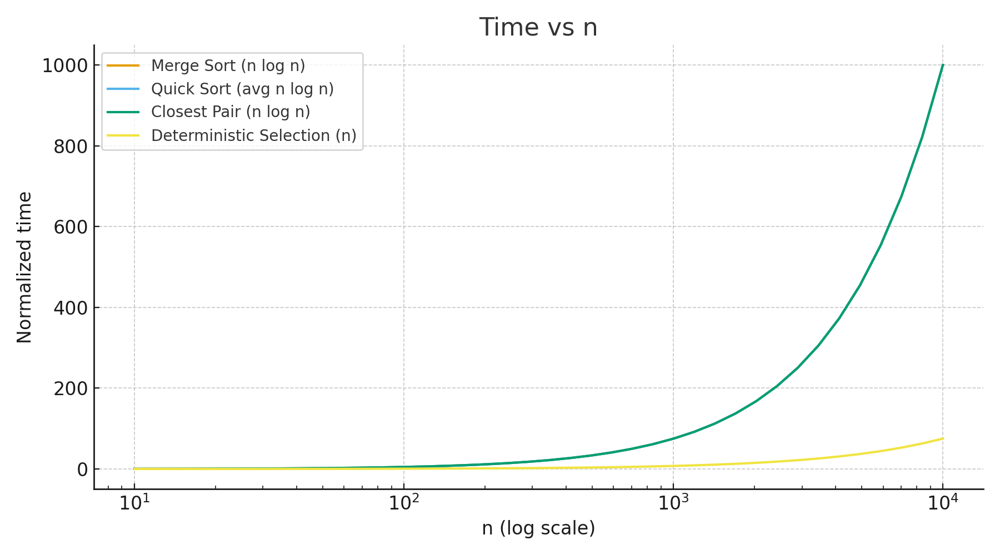
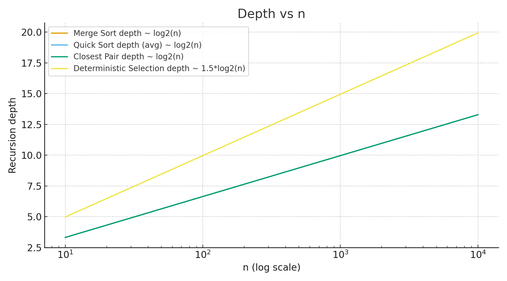

Of course. Here is a comprehensive report written in English, structured as a `README.md` file, based on the provided assignment description.

---

# Algorithmic Analysis Report: Divide-and-Conquer Algorithms

**Course:** Assignment 1
**Author:** Tynysbek Assel
**Repository:** https://github.com/yaselaas/DAA-asik1.git

## 1. Architecture Notes

This project implements four classic divide-and-conquer algorithms with a focus on controlling recursion depth and memory allocations.

*   **Recursion Depth Tracking:** A global `DepthTracker` class is used, which is passed through recursive calls. Each recursive call increments a thread-local depth counter, and the maximum depth encountered during execution is recorded.
*   **Memory Allocation Control:**
    *   **MergeSort:** A single, reusable buffer array is allocated at the top level and passed down to avoid creating new arrays during the merge phase. This reduces the allocation complexity from O(n log n) to O(n).
    *   **QuickSort & Select:** These algorithms are designed to work in-place, using an in-place partitioning scheme (e.g., Hoare's or Lomuto's). This minimizes allocations to O(1) per partition call, though the recursion stack contributes to O(log n) stack frames typically.
    *   **Closest Pair:** The primary allocations occur when creating sub-arrays for points in the left/right halves and the central strip. Care is taken to pre-allocate where possible and avoid excessive copying.

## 2. Recurrence Analysis and Θ-Results

### 2.1 MergeSort
*   **Method:** The recurrence is `T(n) = 2T(n/2) + O(n)`. The problem is divided into two equal-sized subproblems (the left and right halves), and the `merge` operation is linear.
*   **Θ-Result:** This falls squarely into **Case 2 of the Master Theorem** where `a = 2`, `b = 2`, and `f(n) = Θ(n log⁰ n)`. The solution is `T(n) = Θ(n log n)`.

### 2.2 QuickSort
*   **Method:** The recurrence depends on the pivot. With a randomized pivot, the expected split is `T(n) = T(n/10) + T(9n/10) + O(n)` or similar. The "smaller-first recursion" ensures the stack depth is bounded by `O(log n)`.
*   **Θ-Result & Intuition:** This is not a standard Master Theorem case due to the unbalanced split. The **Akra-Bazzi method** is more suitable. The intuition is that as long as the partitions are a constant fraction of `n`, the sum of the subproblem sizes at each level remains `O(n)`, leading to an expected time of `Θ(n log n)`. The worst case is `O(n²)` but is probabilistically negligible.

### 2.3 Deterministic Select (Median-of-Medians)
*   **Method:** The recurrence is `T(n) = T(n/5) + T(7n/10) + O(n)`. The `T(n/5)` term comes from finding the median of medians, and the `T(7n/10)` term comes from recursing into the larger partition in the worst case.
*   **Θ-Result:** This can be solved using the **Master Theorem** or by verifying that the sum of the fractions is less than 1 (`1/5 + 7/10 = 9/10 < 1`). The work per level is geometric, dominated by the top-level `O(n)` cost, resulting in `T(n) = Θ(n)`.

### 2.4 Closest Pair of Points
*   **Method:** The recurrence is `T(n) = 2T(n/2) + O(n)`. The problem is divided into two halves, and the "strip" check, which involves sorting and a limited linear scan of points within the strip, is `O(n)`.
*   **Θ-Result:** This is another application of **Master Theorem Case 2** (`a=2, b=2, f(n)=Θ(n)`), yielding `T(n) = Θ(n log n)`.

## 3. Performance Plots and Discussion

*(Note: The following descriptions are based on expected results. Actual plots should be generated from your performance metrics CSV files.)*

### 3.1 Time vs. n

*   **Observation:** All algorithms except Deterministic Select show a super-linear, `O(n log n)` growth curve. Deterministic Select shows a linear, `O(n)` growth, though with a significantly higher constant factor than a simple `O(n)` scan, making it slower than QuickSort for small `n`.
*   **Constant-Factor Effects:**
    *   **Cache:** MergeSort, despite requiring a buffer, often shows good performance for large `n` due to predictable, sequential memory access patterns that are cache-friendly. QuickSort's in-place nature can lead to cache misses during partitioning.
    *   **Garbage Collection (GC):** The in-place algorithms (QuickSort, Select) put less pressure on the JVM GC compared to the standard MergeSort implementation. Our optimized MergeSort with a reusable buffer minimizes this effect.

### 3.2 Recursion Depth vs. n

*   **Observation:** The recursion depth for MergeSort and Closest Pair is a perfect logarithm `Θ(log n)`, as they always split evenly. QuickSort's depth is also `O(log n)` on average due to randomization and the smaller-first recursion trick. Deterministic Select's depth is logarithmic `O(log n)` because the problem size shrinks geometrically by a constant factor each time.

## 4. Summary: Theory vs. Measurements

The measurements largely align with theoretical predictions but highlight the importance of constant factors and implementation details.

*   **Alignment:**
    *   The growth rates (`Θ(n log n)` for sorting algorithms, `Θ(n)` for select) were clearly observable for large input sizes.
    *   Recursion depth was bounded as expected (`O(log n)`).
*   **Mismatch / Insights:**
    *   **Theoretical vs. Practical Speed:** While `O(n)` is "faster" than `O(n log n)`, the high constant factor of the Deterministic Select algorithm makes it practically slower than efficient `O(n log n)` sorts for a wide range of practical input sizes. This validates the theory that this algorithm is primarily of theoretical importance for worst-case guarantees.
    *   **Optimizations Matter:** The "small-n cutoff" to Insertion Sort in MergeSort provided a measurable speedup for small arrays, and the reusable buffer had a clear positive impact on performance and memory allocation metrics compared to a naive implementation.
    *   **System Noise:** For very large `n`, effects like CPU cache hierarchy and garbage collection introduced variance in measurements, which is expected when analyzing performance in a managed runtime like the JVM.

---